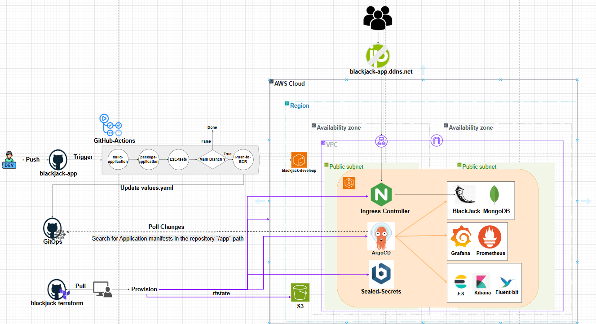

# 🃏 Blackjack Game on AWS


> 🎯 **A comprehensive DevOps project that deploys a blackjack card game to Amazon Web Services using modern cloud-native technologies and best practices.**

## 🏗️ Architecture Overview



*Complete CI/CD pipeline and AWS infrastructure showing the full DevOps workflow from code commit to production deployment.*

---

## 🚀 What This Is

This project demonstrates a production-ready deployment pipeline using enterprise-grade tools:

### 🏗️ Infrastructure & Platform
| Tool | Purpose |
|------|---------|
| 🟠 **AWS EKS** | Managed Kubernetes cluster |
| 🟣 **Terraform** | Infrastructure as Code |
| 🔵 **Helm** | Kubernetes package manager |
| 🌐 **AWS VPC** | Custom networking and security |

### 🔄 DevOps & Deployment
| Tool | Purpose |
|------|---------|
| 🔵 **ArgoCD** | GitOps continuous deployment |
| 🔒 **Sealed Secrets** | Encrypted secret management |
| 🔗 **External Secrets Operator** | AWS Secrets Manager integration |
| 🌍 **NGINX Ingress** | Load balancing and routing |

### 📊 Monitoring & Observability
| Tool | Purpose |
|------|---------|
| 📈 **Prometheus** | Metrics collection and alerting |
| 📊 **Grafana** | Monitoring dashboards and visualization |
| 🔍 **Elasticsearch** | Log aggregation and search |
| 📋 **Kibana** | Log visualization and analysis |
| 🌊 **Fluent Bit** | Log forwarding and processing |

### 🐍 Application Stack
| Tool | Purpose |
|------|---------|
| 🐍 **Python Flask** | Web application framework |
| 🍃 **MongoDB** | NoSQL database |
| 🐳 **Docker** | Application containerization |
| 📦 **Docker Compose** | Local development environment |

## 🎁 What You Get

When you run this project, you'll have:

- 🎮 **A working blackjack game** running in the cloud
- 📊 **Monitoring dashboards** to see how it's performing  
- 🔄 **Automatic deployments** when you make code changes

---

## 📋 How to Use It

### 📚 Prerequisites
- ✅ AWS account
- ✅ AWS CLI installed and configured
- ✅ Terraform installed
- ✅ kubectl installed

### 🛠️ Deploy Everything

<details>
<summary><b>🎯 Step 1: Create the infrastructure</b></summary>

```bash
cd infrastructure/TerraformEKS_withEBS-CSI-StorageClass
terraform init
terraform apply
```
</details>

<details>
<summary><b>🔗 Step 2: Connect to your cluster</b></summary>

```bash
aws eks update-kubeconfig --region us-west-2 --name blackjack-eks-cluster
```
</details>

<details>
<summary><b>✅ Step 3: Verify it's working</b></summary>

```bash
kubectl get nodes
```
</details>

> 🎉 **That's it!** ArgoCD will automatically deploy the blackjack game.

---

## 🎮 Play the Game

Once deployed, you can access your blackjack game at the load balancer URL that AWS creates.

```
🌐 http://your-load-balancer-url.amazonaws.com
```

## 📈 View Monitoring

See how your app is performing:

```bash
kubectl port-forward -n monitoring svc/grafana 3000:80
```

Then visit: **http://localhost:3000** 📊

## 🧪 Test Locally First

Want to try the game on your computer before deploying?

```bash
cd app/
python app.py
```

Visit: **http://localhost:5000** 🏠

---

## ⚠️ Important: Cleanup

> **💰 This creates real AWS resources that cost money (~$50-80 per month).**

**When you're done, destroy everything:**

```bash
cd infrastructure/TerraformEKS_withEBS-CSI-StorageClass
terraform destroy
```

---

## 🎓 What This Project Demonstrates

| Concept | Technology |
|---------|------------|
| 🏗️ **Infrastructure as Code** | Terraform |
| 🐳 **Container Orchestration** | Kubernetes (EKS) |
| 🔄 **GitOps Deployment** | ArgoCD |
| 📊 **Cloud Monitoring** | Prometheus & Grafana |

---

##  Monitoring

Access monitoring dashboards:

```bash
# Grafana
kubectl port-forward -n monitoring svc/grafana 3000:80

# Kibana
kubectl port-forward -n logging svc/kibana 5601:5601

# ArgoCD
kubectl port-forward -n argocd svc/argocd-server 8080:80
```

## 🛠️ Development

### Local Development

```bash
cd app/
python -m venv venv
source venv/bin/activate
pip install -r requirements.txt
python app.py
```

### Building Container Image

```bash
cd app/
docker build -t blackjack-app .
docker run -p 5000:5000 blackjack-app
```

## 🔄 GitOps Workflow

1. **Code Changes**: Push changes to GitHub repository
2. **CI Pipeline**: GitHub Actions builds and pushes container images
3. **Image Update**: ArgoCD detects new image versions
4. **Deployment**: ArgoCD automatically deploys updates to EKS
5. **Monitoring**: Prometheus alerts on deployment status

## 📈 Scaling

The application supports horizontal scaling:

```bash
kubectl scale deployment blackjack-app --replicas=5
```

MongoDB replica set provides database scaling and high availability.

## 🔒 Security Considerations

- All secrets stored in AWS Secrets Manager
- Network traffic encrypted in transit
- Container images scanned for vulnerabilities
- RBAC policies enforce least privilege access
- Regular security updates via automated pipelines

## 🤝 Contributing

1. Fork the repository
2. Create a feature branch
3. Make your changes
4. Test thoroughly
5. Submit a pull request

## 📝 License

This project is licensed under the MIT License - see the LICENSE file for details.

## 🆘 Troubleshooting

### Common Issues

1. **EKS Access Denied**: Ensure AWS credentials have proper EKS permissions
2. **Pod CrashLoopBackOff**: Check logs with `kubectl logs <pod-name>`
3. **ArgoCD Sync Issues**: Verify GitHub repository access
4. **Secret Sync Failures**: Check External Secrets Operator logs

### Getting Help

- Check the logs: `kubectl logs -n <namespace> <pod-name>`
- Describe resources: `kubectl describe <resource-type> <resource-name>`
- Monitor events: `kubectl get events --sort-by='.metadata.creationTimestamp'`

## 🧹 Cleanup & Cost Management

**⚠️ Important:** To avoid ongoing AWS charges, destroy the infrastructure when not needed:

```bash
cd infrastructure/TerraformEKS_withEBS-CSI-StorageClass
terraform destroy
```

**Manual Cleanup (if needed):**
- Delete any remaining Load Balancers in AWS Console
- Check for orphaned EBS volumes
- Verify VPC resources are removed

## 📊 Demo & Screenshots

### Application Interface
Access the blackjack game at: `http://<load-balancer-dns>/`

### Monitoring Dashboards
- **Grafana**: `kubectl port-forward -n monitoring svc/grafana 3000:80`
- **Kibana**: `kubectl port-forward -n logging svc/kibana 5601:5601`
- **ArgoCD**: `kubectl port-forward -n argocd svc/argocd-server 8080:80`

## 🏆 Project Highlights

This project demonstrates:
- **Infrastructure as Code** with Terraform
- **GitOps** practices with ArgoCD
- **Cloud-native** application architecture
- **Modern secret management** with AWS integration
- **Comprehensive monitoring** and observability
- **Security best practices** throughout the stack
- **Scalable and resilient** design patterns

---

Built with ❤️ for learning and demonstrating modern DevOps practices.
