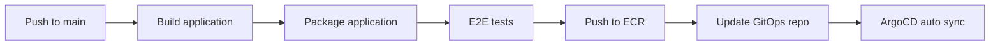
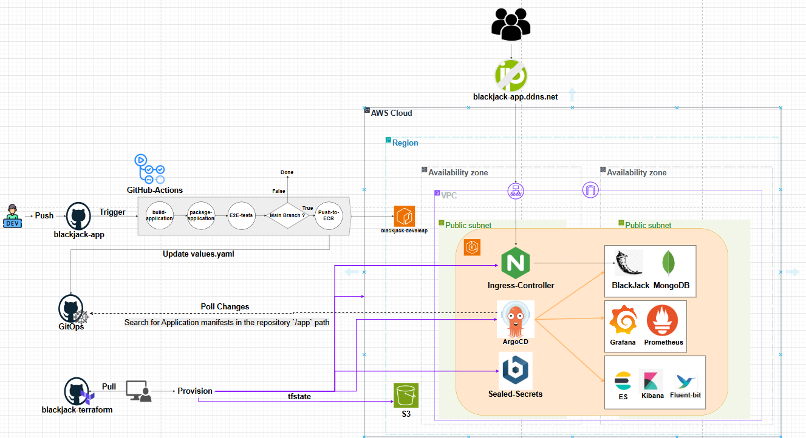

# Blackjack SaaS Application

> A containerized Python Flask Blackjack app with MongoDB backend, demonstrating DevOps practices with Docker, CI/CD (GitHub Actions), semantic versioning, and ECR integration.

## Table of Contents

- [Overview](#overview)
- [Features](#features)
- [Technology Stack](#technology-stack)
- [Repository Structure](#repository-structure)
- [Prerequisites](#prerequisites)
- [Getting Started](#getting-started)
- [CI/CD Pipeline](#cicd-pipeline)
- [Contact](#contact)
- [Acknowledgments](#acknowledgments)

## Overview

This project is a modern Python Flask web application simulating the Blackjack card game, with persistent stats in MongoDB.  
It demonstrates CI/CD automation (GitHub Actions), Docker-based development, and seamless image deployment to AWS ECR.

Key features:

- REST API endpoints: `/health`, `/echo`
- Blackjack game logic with persistent stats
- MongoDB integration for storing wins/losses/draws
- Full GitHub Actions CI/CD with semantic Docker image tagging & ECR push

## Technology Stack

| Category             | Technologies                           |
|----------------------|----------------------------------------|
| **Application**      | Python 3.10, Flask                     |
| **Database**         | MongoDB (Docker, managed, or remote)   |
| **Containerization** | Docker, Docker Compose                 |
| **CI/CD**            | GitHub Actions                         |
| **Version Control**  | Git + GitHub                           |
| **Secrets**          | GitHub Secrets                         |

## Repository Structure

```bash
application/
├── app.py # Main Flask app
├── requirements.txt # Python dependencies
├── Dockerfile # App Docker image build
├── docker-compose.yaml # Local dev/test
├── env.env # App environment variables
├── .github/
│ └── workflows/
│     └── workflow-ci.yaml # GitHub Actions CI/CD pipeline
├── templates/
│ ├── game.html # Game UI template
│ └── result.html # Result UI template
└── README.md
```

## Prerequisites

- Docker & Docker Compose
- Python 3.10+ (optional, for local testing)
- MongoDB (local, Docker, or remote cluster)
- AWS account with:
  - An ECR repository for pushing Docker images
  - EKS cluster (provisioned via Terraform or manually)
  - Proper IAM permissions via environment or GitHub Actions

## Getting Started

### Local Development

1. **Clone and start with Docker Compose**

    ```bash
    git clone https://github.com/alexmachulsky/Application.git
    cd Application
    docker compose up -d
    ```

2. **Open your browser:** [http://localhost:5000](http://localhost:5000)

The app should now be running locally and connected to MongoDB (as defined in your `env.env` and `docker-compose.yaml`).

## CI/CD Pipeline

This project includes a GitHub Actions workflow with these stages:

- Build and test Flask app
- End-to-end test with MongoDB (via Docker Compose)
- Build and tag Docker image
- Push image to AWS ECR (with semantic version)
- Update [blackjack-k8s](https://github.com/alexmachulsky/blackjack-k8s) with the new image tag in the Helm chart
- ArgoCD automatically syncs and deploys the new image to the EKS cluster



### 📊 CI/CD Diagram



_Above: Visual representation of the CI/CD pipeline from GitHub → ECR → Kubernetes._

## GitOps Deployment with ArgoCD

This project uses a GitOps approach for Kubernetes deployments:

- The [blackjack-k8s](https://github.com/alexmachulsky/blackjack-k8s) repository stores all Helm charts and Kubernetes manifests.
- Whenever a new Docker image is pushed, the CI workflow **updates the image tag in the `blackjack-k8s` Helm chart**.
- [ArgoCD](https://argo-cd.readthedocs.io/) continuously monitors the GitOps repo. When it detects a change, it **automatically syncs** the deployment to the EKS cluster—no manual intervention required!
- This enables fully auditable, versioned, and reproducible infrastructure and application rollouts.

## Contact

Alex Machulsky  
[LinkedIn](https://www.linkedin.com/in/alex-machulsky-/)  
[GitHub](https://github.com/alexmachulsky)

